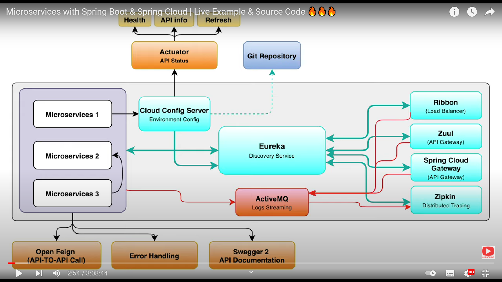

# Spring Cloud Config Server 

_ In a distributed system, Spring Cloud Config Server provide us server side and client side support for externalizing configuration. It provides an option where we can maintain application configurations for all microservices accross multiple environments (dev, qa, prod) accross a central place _ 

# Eureka Discovery Server

_ Eureka discovery server, will contain information regarding all microservices. Every microservice will register itself with Eureka server and eureka server will hold the information about ipaddress, port of the microservices. Every microservice sends the heartbeat to Eureka and Eureka determines the health of the microservice with the heartbeat _

# Ribbon Load Balancer

_ It is responsible for load balancing the request between different instances of the same type of microservice _

# Zuul Api Gateway

_ It is responsible for doing dynamic routing to microservices. _

# Spring cloud Api Gateway

_ Its a non blocking api gateway. It recieves and renders the request asyncronously and returns the response when operation is complete_

# Zipkin 

_ Zipkin is used for distributed tracing of intermicroservice calls. It uses Sleuth to generate trace id for the interaction between microservices.

# Active MQ

_ Active MQ can recieve logs in streaming manner from various microservices and zipkin can use it for distributed log tracing

# Microservice Architecture

{:height="36px" width="36px"}
